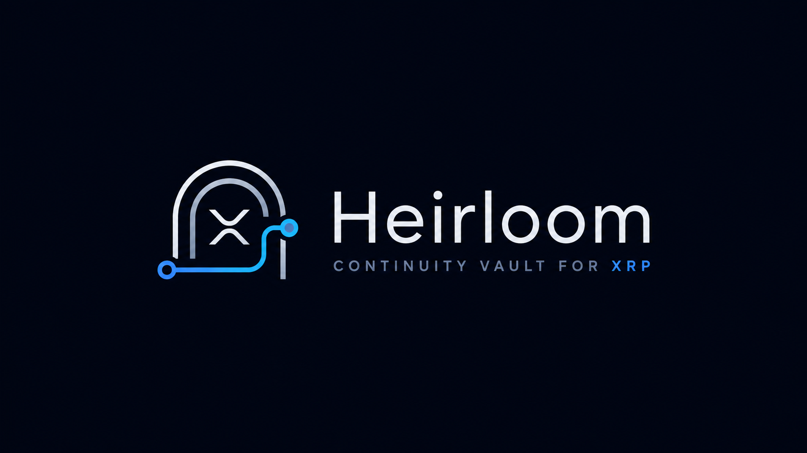

<p align="center"></p>

# Heirloom — the continuity vault for XRP

> **If you go silent, your XRP reaches the person you chose — proven by Flare consensus, never by a company.**

Live app: **https://heirloom.axiqo.xyz** · Network: Flare **Coston2** + **XRPL testnet** (demo timing) · Flare Summer Signal 2026, Bounty 1 (Interoperable Asset Products)

Heirloom is a non-custodial inheritance/continuity mechanism for XRP. The owner keeps their keys and simply stays "alive" with a 1-drop XRPL payment each period. If they go verifiably silent — proven by Flare's Data Connector, not by anyone's database — and a final challenge window passes unvetoed, the vault redeems its FAssets and **real XRP lands on the beneficiary's own XRPL wallet**.

XRPL cannot express this natively: escrows release on fixed dates and cannot be reset by a heartbeat. Programmable custody of XRP is exactly what FAssets provides, and *proof of silence* is exactly what FDC's `ReferencedPaymentNonexistence` attestation provides. Heirloom is the product those two primitives were waiting for.

---

## The two impossibilities

Everything in Heirloom reduces to two guarantees, both enforced by Flare's consensus rather than our code:

**1. An attacker cannot keep the owner "alive."**
Heartbeats are XRPL payments carrying the vault's 32-byte reference — but silence is proven with `checkSourceAddresses = true`. A copycat payment with the identical memo, sent by anyone else, is invisible to the proof. We demonstrated this on-chain:

| test | window contains | source filter | verifier verdict |
|---|---|---|---|
| A | the owner's real heartbeat | on | `INVALID: REFERENCED TRANSACTION EXISTS` — a living owner cannot be claimed against |
| B | only attacker copies of the same memo | on | `VALID` → proof finalized in round `1398559`, verified on-chain by `FdcVerification` |
| C′ | only attacker copies | off | `INVALID` — the source filter is precisely what protects the vault |

**2. The beneficiary cannot come early.**
The claim window is anchored to ledger numbers: it must start exactly at `lastHeartbeatLedger + 1` and cover the whole inactivity period as an unbroken chain of attestations. While the owner is alive the proof is unproducible; after real silence, a challenge window still lets one heartbeat cancel everything (`ClaimVetoed`).

## The canonical case — settled and fully reconciled (Case #001, contract v4)

One real lifecycle on the CURRENT deployed contracts, presented at [/case/001](https://heirloom.axiqo.xyz/case/001)
with a machine-generated, chain-verified manifest (`spike/build-case.mjs` → `web/src/case-001.json`):

| fact | value |
|---|---|
| Vault (v4, veto proof grace live) | [`0x35975770…`](https://coston2-explorer.flare.network/address/0x35975770e1eD5431e0bFCaBB238B6188c94AeAdA) |
| Protected | **10.07569 FXRP** (one XRPL payment, direct-minted) |
| Early-claim drill | blocked on-chain via staticCall — `SilenceNotProven`, funds moved 0 (recorded in the journal) |
| Release timing | waited out challenge **+ 120s** challenge, then the 180s veto-proof grace — the XRPL timestamp decides a veto, never transaction ordering |
| Redeemed | 10.07569 FXRP — the FULL balance, request `#39635850` decoded from the release receipt |
| Delivered | **10.03 XRP** on the beneficiary's own wallet — settlement memo **equals** `RedemptionRequested.paymentReference`, byte for byte |
| Final balance | **0 FXRP — fully reconciled** |
| Verdict | `SETTLED · FULLY RECONCILED` — five integrity checks, all generated from public data |

<details>
<summary>Provenance: earlier full runs (v1 lot-redemption era and the v2 residual case)</summary>

Run 1 (v1, lot redemption): 19.96 FXRP minted → one 10-FXRP lot redeemed → 9.95 XRP (tx `7452922B…754B`).
Run 2 (v2, `redeemAmount`): 10.08 FXRP → 9.95 XRP + 0.08 residual disclosed (vault `0x5655FED7…BaeB`).
Each gap drove the next contract revision — kept as provenance, not as the showcase.
</details>

## How Flare is load-bearing (remove any piece and the product collapses)

- **FAssets** — the only trust-minimized way for a contract to custody XRP and pay real XRP back out (direct minting in, redemption out).
- **FDC `XRPPayment`** — heartbeats, funding detection and cancel commands are all owner-signed XRPL facts, proven to the contract.
- **FDC `ReferencedPaymentNonexistence`** — the FDC's consensus *proof of absence*: source-filtered silence, chained ledger-by-ledger. This attestation type had, to our knowledge, never been showcased in a product before.
- **In the flagship XRP-native mode, the EVM side has no privileged user key.** Every state transition is authorized by an XRPL event or a public timeout; every keeper action is a permissionless crank anyone could submit with the same public data. (The alternative EVM-owner setup uses the owner's own wallet key — never Heirloom's.)

```
XRPL (where you act)                         Flare (where it is proven & enforced)
─────────────────────                        ─────────────────────────────────────
one funding payment ──── XRPPayment proof ──▶ executeDirectMinting → FXRP in vault
1-drop heartbeat ──────── XRPPayment proof ──▶ recordHeartbeat (resets the dial, vetoes claims)
silence (no payment) ──── RPN proof chain ───▶ attestSilence → startClaim → challenge
                    ◀──── FAssets redemption ─ executeRelease
beneficiary's wallet ◀─── real XRP
```

## Try it (judges)

1. **60 seconds:** open https://heirloom.axiqo.xyz/case/001 — the **Live Case Dashboard**: one real completed
   lifecycle in seven chapters (promise → funding → heartbeat → blocked early claim → silence proof →
   challenge → 9.95 XRP delivered), with a dual-ledger transaction rail, a reconciled payout receipt whose
   five integrity checks are generated from chain data (`spike/build-case.mjs`), and a 90-second guided tour.
   No wallet, no waiting, every claim clickable to its explorer page.
2. **5 minutes:** *Create a plan* → connect [GemWallet](https://gemwallet.app) (XRPL-native, the primary path)
   — or the alternative EVM-owner setup (MetaMask/OKX; Coston2 auto-added, one-click check-ins, silence
   measured by consensus time — a simpler model, honestly labelled) — or paste any funded testnet address. The keeper
   deploys **your own vault** on Coston2 → fund it with the one displayed XRPL payment → watch FXRP arrive
   and the dial go live. Send a heartbeat; open the beneficiary view and try to claim early — watch the chain refuse.
3. **Deep:** contracts in [`contracts/`](contracts/) (19 unit tests incl. adversarial, veto-race and partial-redemption suites), proof mechanics in [`spike/`](spike/) (gate scripts with saved on-chain artifacts), keeper in [`keeper/`](keeper/), threat model in [`THREAT_MODEL.md`](THREAT_MODEL.md).

Demo timing note: heartbeat periods are minutes on testnet so the full story is visible in one sitting; production timing would be 90–180 days with 7-day rolling checkpoints: the ~14-day attestation depth was measured, the chaining is contract-enforced, and the keeper now runs a checkpoint scheduler (compressed interval on testnet) that chains proof segments automatically before the window slides away.

## Repository

| path | contents |
|---|---|
| `contracts/` | `HeirloomVault.sol` (7-state machine, dual-proof validation, challenge veto, XRPL-signed cancel, alternative EVM-owner mode), `HeirloomFactory.sol` (EIP-1167 clones), 19 tests, deploy scripts |
| `keeper/` | permissionless crank service: proof automation, auto-scans with self-healing retries, rolling-checkpoint scheduler, redemption-default path, crash-safe journaled state, REST API |
| `web/` | the app — GemWallet integration, Pulse Dial, evidence timeline, printable Recovery Kit |
| `spike/` | gate scripts that de-risked every primitive on-chain before the product was built, with saved proofs |
| `docs/` | design document |

Deployed on Coston2 (v4, source-verified): factory [`0x8FFD0a1DeAb498A5F0A2798bBefb2C071091a77f`](https://coston2-explorer.flare.network/address/0x8FFD0a1DeAb498A5F0A2798bBefb2C071091a77f) · implementation `0xDe3816E38c2cd8F3CD9c8AE10C0a33CD7f7a8A48` · FXRP `0x0b6A…3dc7` · AssetManagerFXRP `0xc1Ca…bDFA`.

**Alternative setup — EVM-owner mode.** XRPL-native is the flagship path and the whole story above: heartbeats are 1-drop XRPL payments proven by FDC, and the EVM side holds no privileged keys at all. For owners without an XRPL wallet, **EVM-owner mode** (MetaMask/OKX) opens a wider door: the vault stores `ownerEvm`, check-ins are one-click `heartbeatEvm()` transactions whose consensus timestamp is the silence clock, and `cancelEvm()` hands the FXRP back — the same state machine, the same challenge window, the same FAssets redemption to the beneficiary's XRPL wallet. Verified end-to-end on Coston2 (create → check-in → cancel, all public transactions).

## Honest boundaries

Heirloom never holds your keys, cannot change your recipient, and cannot release funds before the configured inactivity **and** challenge periods have both elapsed. Settlement relies on Flare FAssets, FDC consensus, and the XRP Ledger; the final payout is a public XRPL transaction. Heirloom is a technical continuity mechanism — **not** a substitute for a legally valid will. Full analysis: [THREAT_MODEL.md](THREAT_MODEL.md).

*Built from scratch during Flare Summer Signal (July 2026).*
